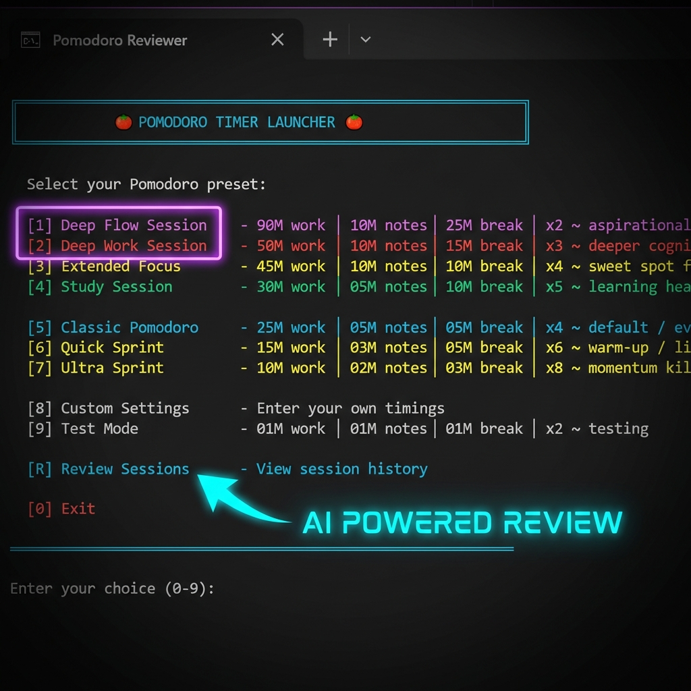

# Pomodoro CLI 🍅




A high-performance, keyboard-centric Pomodoro timer designed for developers and power users who live in the terminal. Features a modern, colorful terminal UI powered by the **Rich** library.

## ✨ Features

- **Rich Terminal UI**: Beautiful progress bars, color-coded time indicators, and a neon/cyberpunk color theme.
- **Live Progress Bar**: Visual countdown with color transitions (Green → Yellow → Red) as time runs out.
- **Distraction-Free**: Runs entirely in your terminal with a blinking cursor ready for input.
- **Integrated Note-Taking**: Capture thoughts instantly without stopping the timer or switching windows.
- **Context-Aware Notes**: Each note is tagged with timestamp, phase, and elapsed minutes.
- **Dynamic Terminal Title**: See current phase and remaining time in your taskbar/window title.
- **Goal Setting**: Set your intentions before each cycle with customizable prompt styles.
- **Cross-Platform**: Native launchers for Windows (`.bat`, `.ps1`) and Linux/macOS (`.sh`).
- **Review System**: Built-in dashboard to visualize your sessions and generate AI summaries of your day.
- **Auto-Open Notes**: Notes file opens automatically when you finish or stop the timer.

## 🚀 Quick Start

### Installation

```bash
pip install rich pygame
```

Or using requirements.txt:
```bash
pip install -r requirements.txt
```

### Windows
Double-click `pomodoro.bat` or `pomodoro_ps.bat` or run in terminal:
```cmd
pomodoro.bat
```

### Linux / macOS
```bash
./pomodoro.sh
```

### Python (Direct)
```bash
# Standard Pomodoro: 25 min work, 5 min journal, 5 min break, 4 cycles
python pomodoro.py -w 25 -n 5 -b 5 -c 4

# Quick test: 1 min each phase, 2 cycles
python pomodoro.py -w 1 -n 1 -b 1 -c 2

# With custom chime sound
python pomodoro.py -w 25 -n 5 -b 10 -c 4 --chime mysound.wav

# Interactive sound selection
python pomodoro.py -w 25 -n 5 -b 10 -c 4 --select-chime
```

## 🎯 Command Line Options

| Option | Short | Default | Description |
|--------|-------|---------|-------------|
| `--work` | `-w` | 25 | Work duration in minutes |
| `--note` | `-n` | 5 | Note-taking/Journal duration in minutes |
| `--break` | `-b` | 10 | Break duration in minutes |
| `--cycles` | `-c` | 4 | Number of cycles to complete |
| `--chime` | | None | Path to .wav file for chime sound |
| `--select-chime` | | | Interactive selection from available .wav files |

## 📝 How It Works

1. **Set Your Adventure**: Before each cycle, you'll be prompted to set your goals.
2. **Work Phase**: A progress bar counts down while you focus. Type notes anytime and press Enter.
3. **Journal Phase**: Dedicated time to capture thoughts and reflect.
4. **Break Phase**: Rest before the next cycle (skipped on last cycle).
5. **Completion**: Chime plays and your notes file opens automatically.

## 🎨 Visual Features

- **Progress Bar**: 52-character bar that changes color as time progresses
  - 🟢 Green: < 70% elapsed
  - 🟡 Yellow: 70-80% elapsed
  - 🔴 Red: > 80% elapsed
- **Blinking Cursor**: Visual indicator that input is ready
- **Terminal Title**: Always shows current phase and remaining time

## 📂 File Structure

```
├── pomodoro.py            # Main application (Python + Rich)
├── pomodoro.bat           # Windows CMD launcher
├── pomodoro.ps1           # Windows PowerShell launcher
├── pomodoro.sh            # Linux/macOS launcher
├── pomodoro.txt           # Your notes and session logs
├── pomodoro_review.html   # Review dashboard (React)
├── pomodoro_review.bat    # Review server launcher (Windows)
├── requirements.txt       # Python dependencies
└── sounds/                # Audio files for chimes
```

## 📖 Documentation

- **[Technical Documentation](CODE_DOCUMENTATION.md)**: Architecture, file structure, and implementation details.
- **[Design Philosophy](DESIGN_PHILOSOPHY.md)**: Why this tool exists and the principles behind it.
- **[Contributing](CONTRIBUTING.md)**: How to set up development environment and submit PRs.

## 🔧 Dependencies

- **Python 3.x**: Required
- **Rich**: Terminal UI library (required)
- **Pygame**: Audio playback (optional, falls back to system beep)

## 📄 License

Copyright (C) 2026 Krishna Kanth B.
This project is licensed under the GNU General Public License v3.0. See [LICENSE](LICENSE) for details.